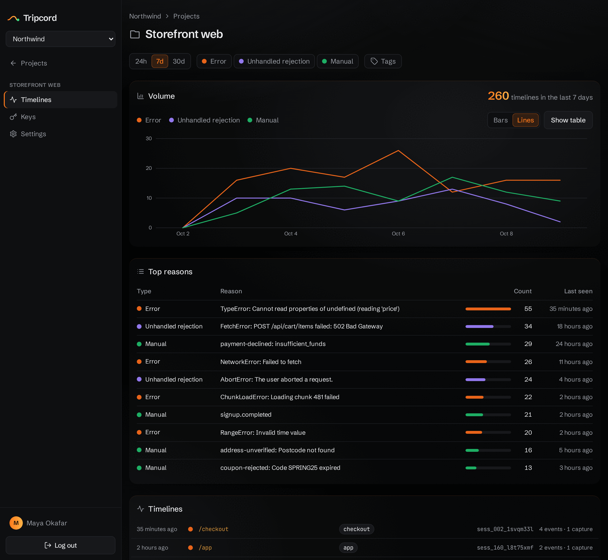

# Tripcord

**Mark the moments that matter in your app. When one happens, Tripcord sends you the path that led there.**

[](https://github.com/jonaszbigda/tripcord/actions/workflows/ci.yml)
[](https://www.npmjs.com/package/@tripcord/js)
[](LICENSE)



Tripcord is a self-hosted timeline tool for web apps. You decide which steps are
worth recording — in the browser and on your server. The browser keeps the most
recent ones and sends nothing; your backend can add its own at any time. Neither
becomes a timeline until something you care about happens: a crash, a checkout,
an abandoned form, a signup. Then Tripcord joins it all into the one session
that led there, with browser and server steps side by side.

No noise, only signal: every event on a timeline is one you chose to record.

## One tool, two questions

**Why did this break?** Uncaught errors are captured automatically. A stack trace
tells you where the code failed. The timeline tells you what the user did to get
there:

```text
TypeError: Cannot read properties of undefined (reading 'price')
on /checkout · tagged checkout

   −41.2s  trace   "Add to cart"
   −18.7s  custom  checkout.step    { step: "shipping" }
    −6.3s  trace   "Apply coupon"
    −1.1s  custom  coupon.applied   { code: "SPRING", valid: false }
```

**How did people get here?** Call `capture()` at any moment that matters to you,
not just failures. The dashboard counts each moment over time, ranks them, filters
them by area of the app, and shows the path behind every one:

```text
signup.completed { plan: "team" }
on /welcome · tagged onboarding

   −95.0s  trace   "Pricing: Team plan"
   −61.4s  custom  signup.step      { step: "account" }
   −22.8s  custom  signup.step      { step: "invite_team", invited: 3 }
```

## How it works

1. **You instrument.** Call `track("checkout.step", { step: "shipping" })`, or add
   `data-trace="Apply coupon"` to an element. Only what you mark is recorded:
   no DOM snapshots, no keystrokes, no network logs. Your backend can record
   steps too, with `@tripcord/js/node` or the REST API.
2. **Everything waits.** The browser keeps the last 50 events in
   `sessionStorage` (or only in memory, with `persist: false`) and sends nothing. Server breadcrumbs are staged on your
   Tripcord server and stay invisible. Neither is a timeline yet.
3. **A moment happens.** An uncaught error, an unhandled rejection, a React error
   boundary, or your own `capture("signup.completed")` — from the browser or the
   server. Tripcord **bakes** the session: it merges the staged server events
   with the browser's, deduped and in order, into one timeline.
4. **You read it.** One session is one timeline, with browser and server events
   distinguished and each capture marked. The dashboard charts volume over time,
   ranks the most common errors and captures, and filters by tag.

## How it compares

|  | Error tracker | Session replay | Product analytics | Tripcord |
| --- | --- | --- | --- | --- |
| What you get | A stack trace | A recording of everything | Aggregate counts and funnels | The path to each moment you mark |
| When data is sent | On errors | Continuously | On every event | Only when a marked moment happens |
| What's sent | The error | Everything on the page | Every tracked event | A short timeline you wrote |
| Keeping personal data out | Mostly easy | Masking rules and audits | Per-event review | You write every event, so you decide |

Tripcord sits between these tools. An error tracker tells you what failed, and
analytics tells you how many. Tripcord shows the steps an individual user took to
reach a moment, and how often that moment happens.

## Quick start

**1. Run a server.** Tripcord is self-hosted: one Docker image (the API plus the
dashboard) and Postgres. See [Self-hosting](docs/self-hosting.md). It takes a
Compose file, two settings and `docker compose up -d`.

**2. Install the client** and point it at your server, using an API key from the
dashboard:

```bash
npm i @tripcord/js
```

```ts
import { init, track, capture, setTags } from "@tripcord/js";

init({
  endpoint: "https://tripcord.example.com/v1/timeline",
  apiKey: "tpk_…",
});

setTags(["onboarding"]);                       // which area of the app this is
track("signup.step", { step: "account" });     // a step worth remembering
capture("signup.completed", { plan: "team" }); // a moment worth a timeline
```

```html
<button data-trace="Pricing: Team plan">Choose Team</button>
```

Uncaught errors are captured without any code. For React, wrap your tree in
`<ErrorBoundary>` from `@tripcord/js/react`. The
[client README](packages/js/README.md) covers tags, manual captures and
controlling which page URLs are sent.

**Nothing stored on the device (optional).** By default the client keeps the
session id and recent events in `sessionStorage`, so a timeline survives page
loads. Pass `persist: false` and it stores nothing on the visitor's device: no
cookies, no `sessionStorage`, no `localStorage`. The timeline lives in memory
until the page unloads, which suits single-page apps and sites with client-side
navigation:

```ts
init({ endpoint: "…", apiKey: "tpk_…", persist: false });
```

**3. Add server breadcrumbs (optional).** A backend can record its own steps — an
API call, a background job — into the same session:

```ts
import { createTracer } from "@tripcord/js/node";

const tracer = createTracer({
  endpoint: "https://tripcord.example.com/v1/timeline",
  apiKey: "tpk_…",
  sessionId,
});
tracer.track("job.started", { jobId });
tracer.capture("job.failed", { reason });
```

Anything else — Python, Go, .NET — can POST to the same REST API; see the
[server README](server/README.md).

## Status

Tripcord is early, and the idea is still being tested on real apps. What exists
today:

- **`@tripcord/js`**: the browser client (a framework-agnostic core and a React
  error boundary) and a Node client at `@tripcord/js/node`. Both stamp every
  event with an id and a `source`, so browser and server breadcrumbs land in one
  session. The browser client can run without storing anything on the device
  (`persist: false`). TypeScript, ESM and CommonJS.
- **The server**: the ingest API, with API keys per project and rate limits, and
  a dashboard with accounts, orgs, invites, GitHub login and a session viewer:
  a volume chart, top errors and captures, tag filters, and per-session detail
  that merges browser and server events. Events are **staged** until a capture
  **bakes** them, and staged events that never get baked are pruned. Released as
  a Docker image for amd64 and arm64.

Not yet: a hosted version, clients for platforms other than the browser and Node,
alerts, grouping similar errors, and analytics across sessions, such as funnels
or the most common paths to a moment.

## Repository

| Path | What it is |
| --- | --- |
| [`packages/js`](packages/js) | `@tripcord/js`, the browser and Node clients, published to npm |
| [`server`](server) | The ingest API and dashboard backend (Fastify, Postgres). Its README covers configuration and running from source. |
| [`dashboard`](dashboard) | The dashboard (React SPA), built into and served by the server |
| [`deploy`](deploy) | The Compose file for running a released image |
| [`docs`](docs) | [Self-hosting](docs/self-hosting.md), [releasing](docs/releasing.md), and the design specs in [`docs/superpowers/specs`](docs/superpowers/specs) |

## Development

An npm workspaces monorepo. Server tests need Docker (they start Postgres with
testcontainers).

```bash
npm install
npm run build        # every workspace
npm test             # every workspace, plus the release scripts' tests
npm run lint
npm run typecheck
docker compose up -d --build   # server + Postgres from source, on localhost:3000
```

CI runs all of this on every push. Releases are cut from git tags; see
[`docs/releasing.md`](docs/releasing.md).

## License

MIT — see [`LICENSE`](LICENSE).
